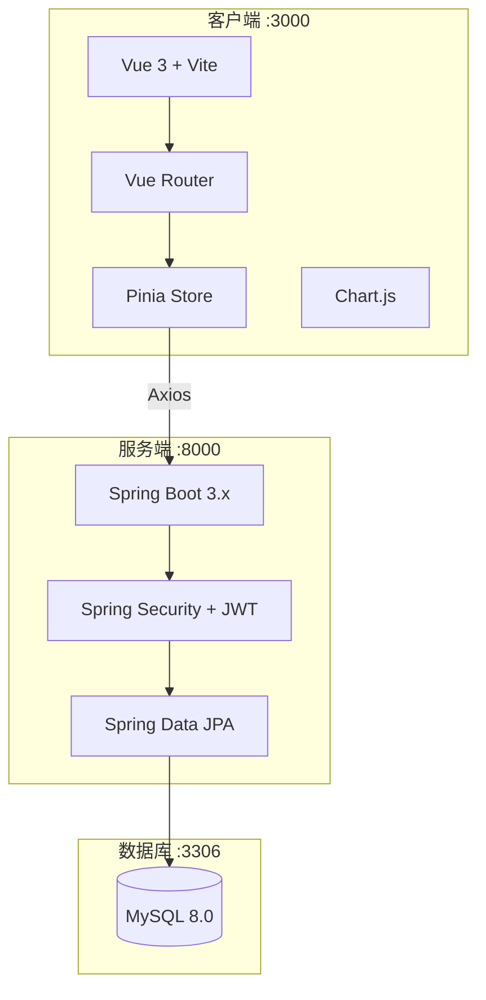
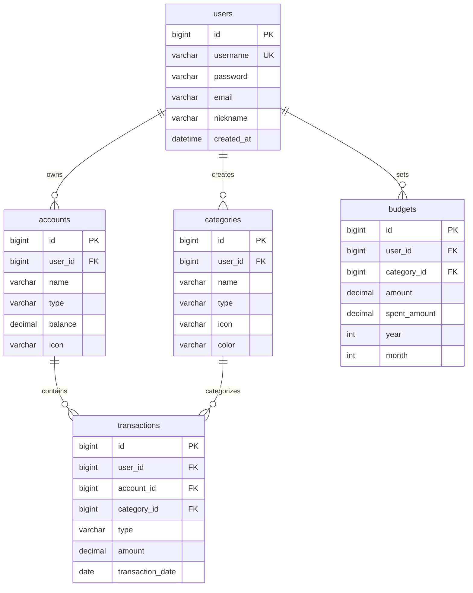

# 🚀 智能记账服务

> **智能记账，轻松理财 —— 您的个人财务管家**

一个商业级的全栈记账服务系统，帮助用户轻松管理个人财务，追踪收支，设定预算，分析消费习惯。

## 📋 项目摘要

本项目是一个完整的个人记账解决方案，解决了以下核心痛点：
- 🎯 **收支管理混乱** - 提供清晰的收支记录和分类管理
- 📊 **财务状况不明** - 实时统计和可视化报表
- 💸 **预算控制困难** - 智能预算设置和超支提醒
- 📱 **多端同步需求** - Docker 容器化，一键部署

---

## 🏗️ 系统架构



---

## 🛠️ 技术栈

| 层级 | 技术 |
|------|------|
| **Frontend** | Vue 3, Vite, Vue Router, Pinia, Axios, Chart.js |
| **Backend** | Java 17, Spring Boot 3.2, Spring Security, JWT |
| **Database** | MySQL 8.0 |
| **Infra** | Docker, Docker Compose, Nginx |

---

## 💾 数据库设计



---

## ⚡ 快速启动 (Docker)

### 前置要求
- Docker Desktop 已安装并运行

### 一键启动

```bash
# 1. 进入项目目录

# 2. 构建并启动所有服务
docker compose up --build

# 等待约 2-3 分钟完成构建和启动
```

### 访问地址

| 服务 | 地址 |
|------|------|
| 🖥️ 前端界面 | http://localhost:3000 |
| 🔧 后端 API | http://localhost:8000/api/health |
| 🗄️ 数据库 | localhost:3306 |

---

## 🧪 测试账号

| 用户名 | 密码 | 说明 |
|--------|------|------|
| admin | Admin123456 | 管理员账号 |

> 💡 首次访问请先注册账号或使用测试账号登录

---

## 📷 功能介绍

### 1️⃣ 仪表盘
- 实时显示总资产、本月收支、结余
- 收支趋势图表
- 支出分类占比
- 最近交易记录
- 账户余额一览

### 2️⃣ 交易记录
- 记录收入和支出
- 分页浏览历史记录
- 编辑和删除交易
- 按日期筛选

### 3️⃣ 账户管理
- 支持多种账户类型（现金、银行卡、信用卡、支付宝、微信等）
- 自定义账户图标和颜色
- 实时余额更新

### 4️⃣ 分类管理
- 预置常用收支分类
- 自定义分类名称、图标、颜色
- 支持收入和支出分类

### 5️⃣ 预算管理
- 按月设置分类预算
- 实时显示预算使用进度
- 超支预警提醒

### 6️⃣ 统计报表
- 月度收支汇总
- 分类占比饼图
- 多月收支趋势对比

---

## 📁 项目结构

```
记账服务/
├── README.md                    # 项目说明文档
├── docker-compose.yml           # Docker 编排文件
├── backend/                     # 后端 Spring Boot
│   ├── Dockerfile
│   ├── pom.xml
│   └── src/main/java/com/accounting/
│       ├── controller/          # REST API 控制器
│       ├── service/             # 业务逻辑层
│       ├── repository/          # 数据访问层
│       ├── entity/              # 数据库实体
│       ├── dto/                 # 数据传输对象
│       ├── security/            # JWT 认证
│       ├── config/              # 配置类
│       └── exception/           # 异常处理
└── frontend/                    # 前端 Vue 3
    ├── Dockerfile
    ├── nginx.conf
    ├── package.json
    └── src/
        ├── views/               # 页面组件
        ├── components/          # 通用组件
        ├── stores/              # Pinia 状态管理
        ├── router/              # 路由配置
        ├── api/                 # API 接口
        └── assets/              # 静态资源
```

---

## 🔧 专业工程实践

### 1. 日志系统
- 使用 SLF4J + Logback
- 分级日志 (DEBUG, INFO, WARN, ERROR)
- 关键操作审计日志
- 日志文件持久化

### 2. 错误处理
- 全局异常处理器 `@ControllerAdvice`
- 统一错误响应格式 `ApiResponse`
- 友好的中文错误提示

### 3. 数据校验
- JSR-303 Bean Validation
- 前后端双重校验
- 参数边界检查

### 4. 接口设计
- RESTful API 规范
- 统一响应格式
- Token 认证保护

### 5. 生产级特性

| 特性 | 状态 | 说明 |
|------|:----:|------|
| JWT 认证 | ✅ | 无状态安全认证 |
| 密码加密 | ✅ | BCrypt 加密存储 |
| 数据持久化 | ✅ | MySQL + Docker Volume |
| 容器化部署 | ✅ | 一键 Docker Compose |
| 响应式布局 | ✅ | PC/移动端自适应 |
| 模块化设计 | ✅ | 分层架构 |
| 健康检查 | ✅ | 服务状态监控 |
| CORS 配置 | ✅ | 跨域请求支持 |

---

## 🛑 常见问题

### Q: 启动后无法访问？
1. 确保 Docker Desktop 正在运行
2. 等待 2-3 分钟让服务完全启动
3. 检查端口 3000、8000、3306 是否被占用

### Q: 登录失败？
1. 确认使用正确的测试账号
2. 首次使用需要先注册账号

### Q: 数据丢失？
Docker Volume 会持久化数据，重启容器不会丢失数据。
如需清理数据：`docker compose down -v`

---

## 📜 License

MIT License

---

**Made with ❤️ by Accounting Service Team**
